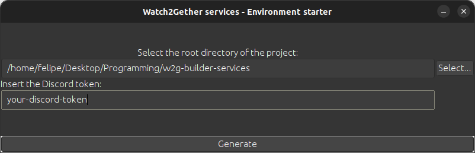
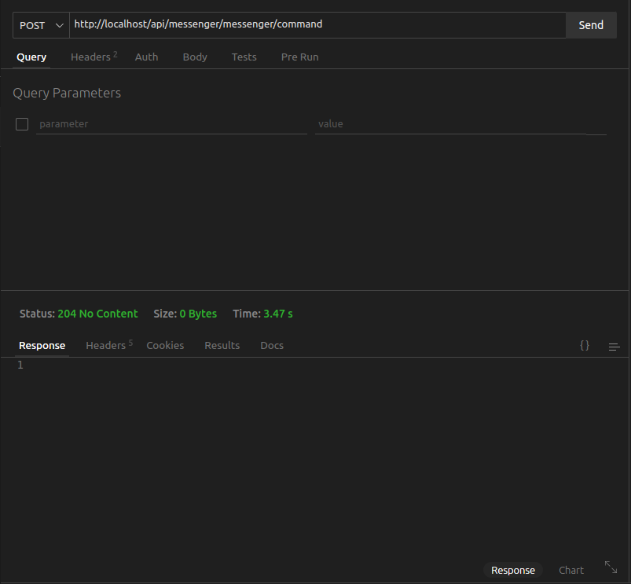
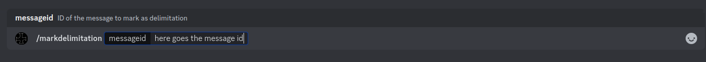
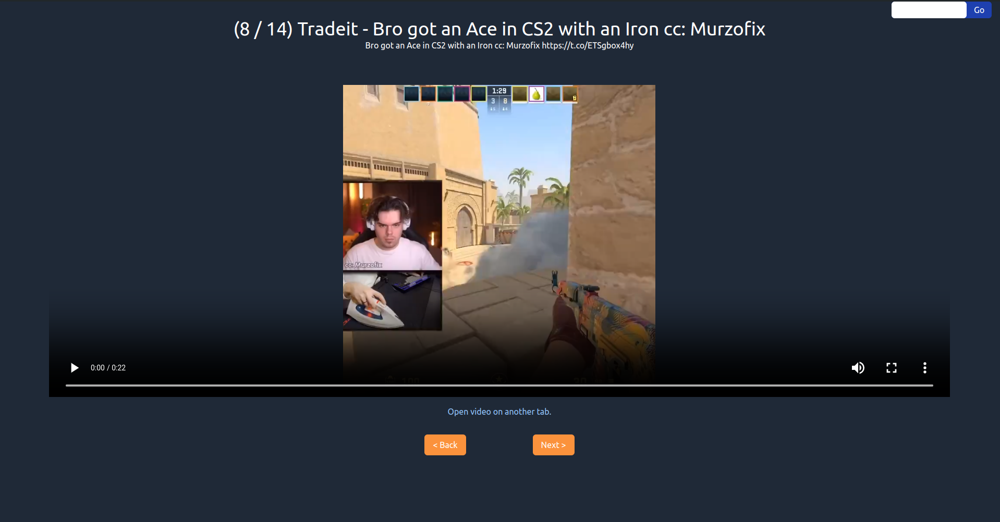

[Versão PT-BR aqui](./README-pt-br.md)

---
<h1 align="center">📽️ Watch2Gether Services & Builder 🛠️</h1>

A reimagining of the [Watch2Gether](https://w2g.tv/en/) website, but built using a microservices architecture. This project was created with the goal of learning new technologies (for example: RabbitMQ and Angular) while simultaneously rewriting this tool in new technologies.

Table of Contents:
- [1. Configuring the application](#1-configuring-the-application)
  - [1.1 Configuring the application - Docker](#11-configuring-the-application---docker)
  - [1.2 Configuring the application - local machine](#12-configuring-the-application---local-machine)
- [2. Application limitations](#2-application-limitations)
- [3. Usage](#3-usage)
- [4. Technologies used](#4-technologies-used)
- [5. License](#5-license)

# 1. Configuring the application
The application has been "dockerized", therefore, it can be run in containers. However, it is necessary to initially configure the environment variables. Each application has its own environment variables, and in the [environment variables folder](./env/), you can find examples for each application.

## 1.1 Configuring the application - Docker
To configure the application with Docker, you can use either the [normal Docker Compose file](./docker-compose.yaml) or the [local Docker Compose file](./docker-compose-local.yaml). The normal Docker Compose points to the environment variables present in the `/env/[application name]/env` folder (ideal for running the application if you want to change multiple environment variables), while the local Docker Compose points to the environment variables in the `/env/[application name]/local` folder (ideal for quickly running the application, just by changing the Discord API Token).

Additionally, I have created a tool called "[Environment starter](./apps/envstarter/)" to assist in creating environment variable files, which can be downloaded from the packages in this repository. To use it is simple: just open the executable ".jar" with the command `java -jar [jar name].jar`. With that, just enter the root folder location of this project and the Discord API Token and then click "Generate":

With this, environment variable files will be created inside the `/env/[application name]/env` folders, mirrored in the local variable files.

Finally, when starting the Compose, it is necessary to select one of the services "nginx-dependencies" or "nginx-no-dependencies" (it is not possible to select both simultaneously). The "nginx-dependencies" makes Nginx start after all applications have started, while the "nginx-no-dependencies" makes Nginx start without depending on any application.

## 1.2 Configuring the application - local machine
To configure the application without Docker, you need to run the applications based on the examples of [environment variable files](./env/).

# 2. Application limitations
The current major limitation of the application is that it does not add bot commands to the server as soon as it joins the guild. As I previously mentioned: this application is not meant to be taken seriously, but rather as a mere experiment in technologies and learning.

To work around this issue, you need to send an HTTP request of method "POST" to the endpoint `[application address "Messenger"]/messenger/command` ([defined in this controller](./apps/messenger/src/modules/messenger/controllers/messenger.controller.ts)). Here's an example using Thunder Client:

# 3. Usage
The usage of this application is relatively simple: initially, you need to mark a delimiter message in the Discord channel where you want to "assemble the Watch2Gether":

After that, this message and all subsequent messages will have the content of downloaded videos (for example: YouTube videos, Instagram videos, etc.).

With the delimiter message defined, simply access the Front-end address (via Angular it's [localhost:4200](http://localhost:4200), via Docker with default settings it's [localhost:80](http://localhost)), enter the guild and desired channel:

# 4. Technologies used
- [Builder - application responsible for assembling the list of videos to watch](./apps/builder/): Kotlin with Spring in Java 21
- [Downloader - application responsible for downloading videos and storing them in the File Storage API](./apps/downloader/): Node.js with Nest and YoutubeDL
- [Environment Starter - GUI to quickly generate environment configuration](./apps/envstarter/): Java 21 with Swing (yes, Swing in 2024)
- [File Storage - application responsible for storing files](./apps/file-storage/): Quarkus and Java 21
- [Front-end](./apps/frontend/): Angular 17 and TailwindCSS
- [Messenger - application containing the Discord Bot](./apps/messenger/): Node.js with Nest and Discord.js
- [Nginx - general server](./apps/nginx/).

# 5. License
Feel free to do whatever you want with this code.
